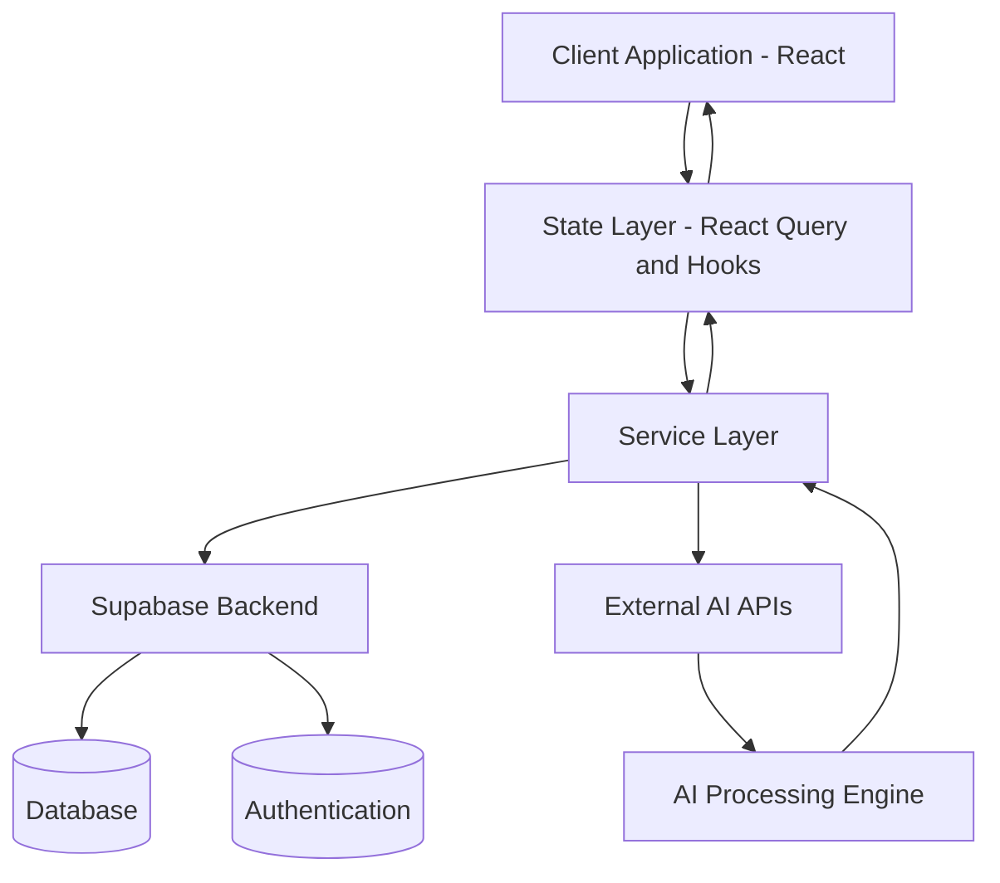
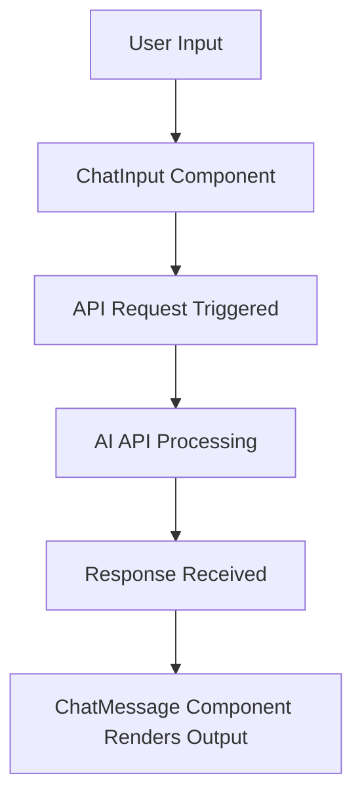
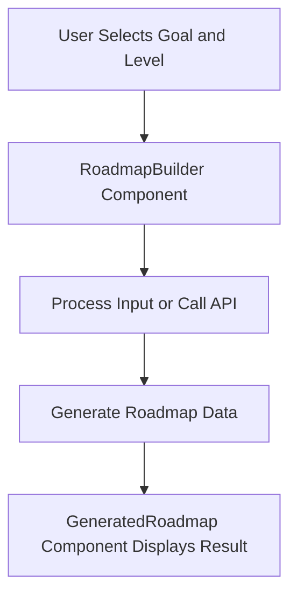
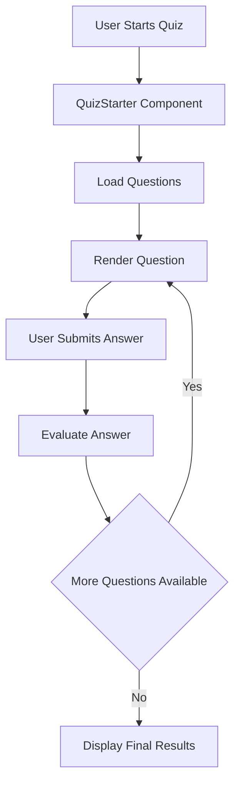
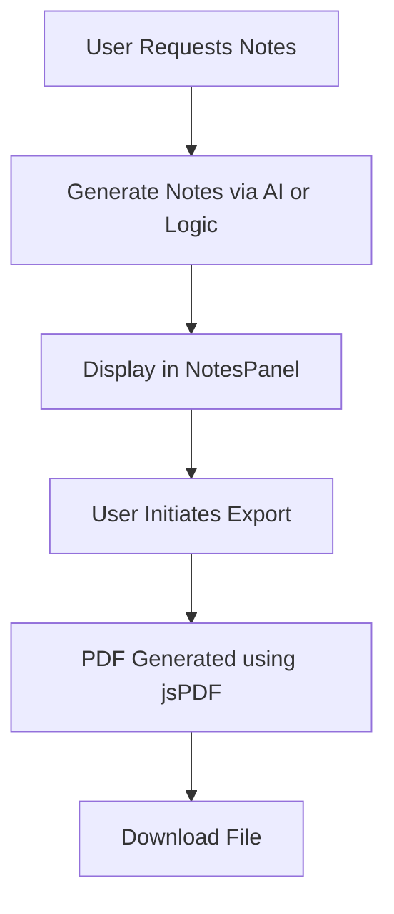
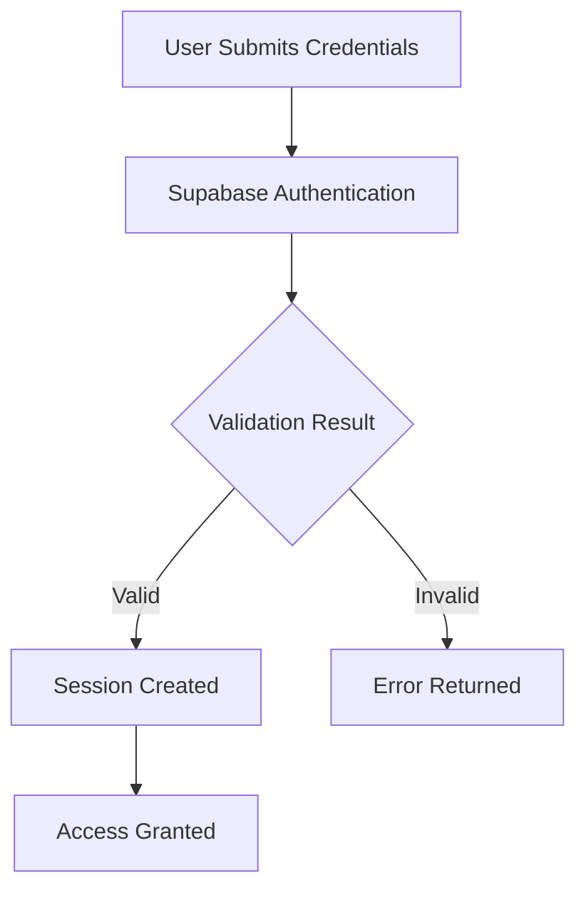

# DSA Buddy – AI-Powered Data Structures & Algorithms Learning Platform

## Overview

DSA Buddy is a modern web application designed to streamline the process of learning Data Structures and Algorithms through structured guidance and AI-assisted interactions. The platform combines conversational AI, personalized roadmap generation, interactive quizzes, and notes creation into a unified learning experience.

The system is built using a frontend-centric architecture and leverages Backend-as-a-Service (BaaS) and external AI APIs to handle backend responsibilities.

---

## Key Features

### AI Chat Assistant

Enables users to ask questions related to DSA concepts and receive structured, contextual responses through an interactive chat interface.

### Personalized Roadmap Generator

Generates tailored learning paths based on user-selected goals and proficiency level, helping users follow a structured progression.

### Interactive Quiz System

Provides topic-based quizzes with answer evaluation to reinforce learning and assess understanding.

### Notes Generation and Export

Generates structured notes and allows users to export them as downloadable PDF documents.

### Authentication and Session Management

Handles user authentication securely using Supabase, including login, signup, and session persistence.

---

## Technology Stack

### Frontend

* React (v18)
* TypeScript
* Vite

### UI and Styling

* Tailwind CSS
* shadcn/ui
* Radix UI

### State Management

* TanStack React Query
* React Hooks

### Routing

* React Router

### Forms and Validation

* React Hook Form
* Zod

### Backend Services

* Supabase (Authentication and Database)

### Additional Libraries

* jsPDF (PDF generation)
* Recharts (data visualization)
* Vitest (testing)

---

## System Architecture



---

## Functional Flow

### Chat System



---

### Roadmap Generation



---

### Quiz System



---

### Notes Generation and Export



---

### Authentication Flow



---

## Project Structure

```
src/
│
├── components/
│   ├── ChatInput.tsx
│   ├── ChatMessage.tsx
│   ├── QuizStarter.tsx
│   ├── QuizQuestion.tsx
│   ├── RoadmapBuilder.tsx
│   ├── GeneratedRoadmap.tsx
│   ├── NotesPanel.tsx
│
├── pages/
├── hooks/
├── services/
├── lib/
│
├── App.tsx
├── main.tsx
```

---

## Environment Configuration

Create a `.env` file in the root directory and define the following variables:

```
VITE_SUPABASE_URL=your_supabase_project_url
VITE_SUPABASE_ANON_KEY=your_supabase_anon_key
VITE_AI_API_KEY=your_ai_api_key
```

---

## Setup and Installation

### Clone the repository

```
git clone <repository-url>
cd <project-folder>
```

### Install dependencies

```
npm install
```

### Start development server

```
npm run dev
```

### Build for production

```
npm run build
```

---

## Design Principles

* Modular component-based architecture
* Clear separation of concerns between UI and data handling
* API-driven communication model
* Scalable and maintainable frontend structure
* Backend abstraction using BaaS

---

## Limitations

* Direct API calls from frontend may expose sensitive keys
* Limited backend customization due to reliance on external services
* Performance dependent on third-party APIs

---

## Recommended Improvements

* Introduce a backend layer (Node.js or similar) for API proxying
* Implement secure key management
* Add role-based access control
* Enhance caching strategies and performance optimization
* Integrate logging and monitoring systems

---

## Use Cases

* Data Structures and Algorithms learning platforms
* AI-powered educational tools
* Developer portfolio projects
* EdTech SaaS applications

---

## License

This project is intended for educational and development purposes. It can be extended and customized based on requirements.

